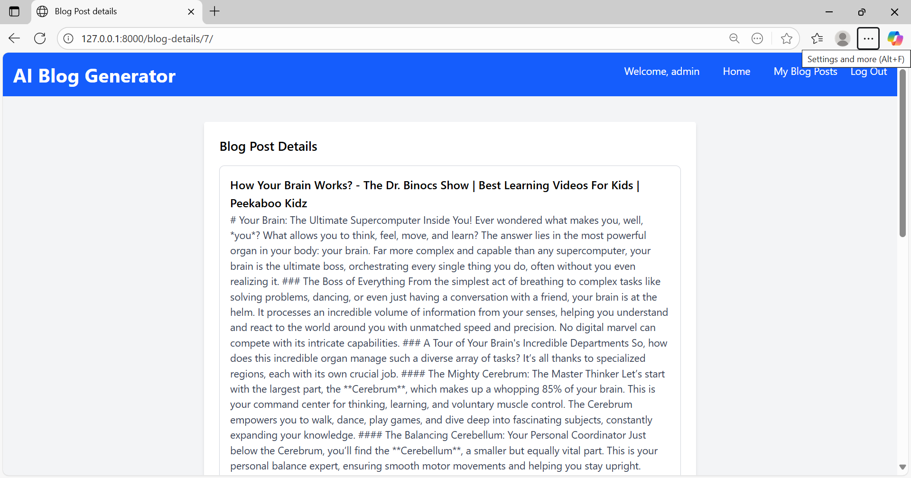

# Django AI Blog Generator 🤖📝

**⭐ This project demonstrates **AI + Django + YouTube Integration + Deployment skills** → perfect for resumes & portfolios.** 

Generate polished blog posts automatically from YouTube videos using AI.
This project combines YouTube transcript extraction, Whisper transcription, and Google Gemini to turn spoken content into well-structured articles.

---

## 🚀 Features

### 🎥 YouTube Integration
- Extract video title, captions, and audio.
- Support for normal & shortened YouTube URLs.

### 🗣 Dual Transcription Pipeline
- Fetch official YouTube captions (if available).
- Run Whisper (tiny model) for accurate speech-to-text.
- Merge both into a clean transcript.

### ✍️ AI Blog Content Generation
- Gemini 2.5 API rewrites transcripts into professional blog posts.
- Removes repetitions, filler words, and makes content engaging.

### 📝 Blog Management (CRUD)
- Save, view, and delete generated blogs.
- Each blog tied to its owner (permissions enforced).

### 🔐 User Authentication
- Signup, login, and logout support.
- Blog visibility restricted to the creator.

### ⚡ Other Features
- Responsive UI (HTML templates + static assets)  
- File-based caching for faster performance  
- Easy deployment with `requirements.txt`  

---

# 🛠️ Tech Stack

## Backend: 
- Django

## AI Models:
- OpenAI Whisper (local transcription)
- Google Gemini (content generation)

## YouTube Tools:
- yt-dlp (audio download + metadata)
- youtube-transcript-api (captions fetch)

## Database: 
- SQLite (default, can swap for PostgreSQL)

---

## 📂 Project Structure

ai_blog_app_project/<br>
│<br>
├── Back-End/                       # Main Django backend<br>
│   ├── ai_blog_blog_generator/           # Django project folder<br>
│   │   ├── ai_blog_app/            # Core Django project (settings, urls, wsgi, asgi)<br>
│   │   │   ├── __init__.py<br>
│   │   │   ├── asgi.py<br>
│   │   │   ├── settings.py<br>
│   │   │   ├── urls.py<br>
│   │   │   └── wsgi.py<br>
│   │   │<br>
│   │   ├── blog_generator/         # Django app (blog features)<br>
│   │   │   ├── __init__.py<br>
│   │   │   ├── admin.py<br>
│   │   │   ├── apps.py<br>
│   │   │   ├── models.py<br>
│   │   │   ├── tests.py<br>
│   │   │   ├── views.py<br>
│   │   │   ├── urls.py<br>
│   │   │   └── migrations/<br>
│   │   │<br>
│   │   ├── django_cache/           # File-based cache (ignored in GitHub)<br>
│   │   ├── media/                  # User-uploaded media (ignored in GitHub)<br>
│   │   ├── static/                 # Project static assets (favicon, css, js) <br>
│   │   ├── staticfiles/            # Auto-generated static files (ignored in GitHub)<br>       
│   │   ├── nginx/                  # for nginx <br>     
│   │   │   └── nginx.conf<br>
│   │   │<br>
│   │   ├── templates/              # HTML templates for backend<br>
│   │   │   ├── index.html<br>
│   │   │   ├── login.html<br>
│   │   │   ├── signup.html<br>
│   │   │   ├── all-blogs.html<br>
│   │   │   ├── blog-details.html<br>
│   │   │   └── blog-delete.html<br>
│   │   │<br>
│   │   ├── .env                    # .env file (ignored in GitHub)<br>
│   │   ├── db.sqlite3              # SQLite database (ignored in GitHub)<br>
│   │   ├── docker-compose.yml      # Docker YML File for Containerization <br>
│   │   ├── Dockerfile              # Docker File for Containerization <br>
│   │   ├── manage.py               # Django management script<br>
│   │   ├── requirements-linux.txt  # Main requirements file for Linux(for deployment)<br>
│   │   └── requirements.txt        # Main requirements file (for deployment)<br>
│   |<br>
│   └── virtual_envi/<br>
│<br>
├── Front-End/                      # Early static mockups (not final) <br>
│   ├── index.html<br>
│   ├── login.html<br>
│   ├── signup.html<br>
│   ├── all-blogs.html<br>
│   └── blog-details.html<br>
│<br>
├── screenshots/                    # screenshots of the application<br>
│<br> 
├── .gitignore                      # Ignore unnecessary files/folders<br>
│<br>
├── requirements-linux.txt          # Main requirements file for Linux(for deployment)<br>
│<br>
├── requirements.txt                # Main requirements file (for deployment)<br>
│<br>
└── README.md                       # Project documentation<br>

---

## ⚙️ Installation & Setup

1. **Clone the repository**<br>
    ```bash <br>
    git clone https://github.com/sarabhanuprasadgoud-collab/ai-blog-article-generator.git
    cd ai_blog_app/Back-End/ai_blog_app
    ```

2. **Create and activate a virtual environment**<br>
    python -m venv venv<br>
    venv\Scripts\activate.bat       # On Windows<br>
    source venv/bin/activate        # On macOS/Linux<br>
    Tip: If you face issues, delete any old `venv/` and recreate it.<br>

3. **Install dependencies**<br>
    pip install -r requirements.txt<br>

4. **Set up environment variables**<br>
    - Create a .env file inside Back-End/ai_blog_app/ai_blog_app/
    - Add your Django settings (SECRET_KEY, database config, etc.)
    - Add secret keys to .env file 
        - DEBUG=True
        - SECRET_KEY=your-django-secret-key
        - GEMINI_API_KEY=your-gemini-api-key

5. **Make migrations**<br>
    python manage.py makemigrations

6. **Run migrations**<br>
    python manage.py migrate

7. **Create Superuser**<br>
    python manage.py createsuperuser   # Optional (to access Django admin)

8. **Start the server**<br>
    python manage.py runserver

9. **Now open below Link**<br>
    👉 http://127.0.0.1:8000/

---

## 🎯 Usage Flow
1. Signup or login.
2. Enter a YouTube link.
3. The system:
    - Extracts captions & downloads audio.
    - Runs Whisper + captions to get transcript.
    - Sends transcript to Gemini → generates blog.
    - Saves blog to your account.
4. Manage your blogs (list, view, delete).

---

## 🔗 Live Demo 
| Watch the Demo 🎥 | Status 🚀 |
|-------------------|-----------|
| [](https://www.youtube.com/watch?v=WEALwtz2Eig) | **Deployed version coming soon. Stay tuned!** |

---

## 📸 Screenshots  

### 🔐 Authentication

| **Signup Page** | **Login Page** |
|-----------------|----------------|
|  |  |

---

### 🏠 Home Workflow<br>

| **Home Page** |
|---------------|
|  | 

| **Home with URL Before Submission** | **Home with URL After Submission (Loading)** |
|-------------------------------------|----------------------------------------------|
|  |  |

|  **Result (Top)** | **Result (Bottom)** |
|-------------------|---------------------|
|  |  |

---

### 📝 Blog Management<br>

| **Blog Posts Page** |
|---------------------|
|  | 

| **Blog Details (Top)** | **Blog Details (Bottom)** |
|-------------------------|--------------------------|
|  |  |

| **Blog Delete Confirmation** |
|-------------------------------|
|  |

---

## 🔗 API Demo <br>

Example request to generate a blog via API:

```bash
curl -X POST http://127.0.0.1:8000/generate_blog/ \
     -H "Content-Type: application/json" \
     -d '{"link": "https://youtu.be/VIDEO_ID"}'
```
---

## 🛡️ Notes<br>
- Requires FFmpeg installed & added to PATH (for yt-dlp audio processing).
- Whisper model loads once at server start (default: tiny).
- Blog outputs are cached for 24 hours for performance.

---

## 🌍 Deployment<br>
This project can be deployed for free using:
- [Render](https://render.com/)
- [Railway](https://railway.app/)
- [Heroku](https://www.heroku.com/)
- [Vercel (Frontend only)](https://vercel.com/)
Detailed deployment guide coming soon.
### 📦 Requirements
Add a quick note on requirements file:  
```md
- All dependencies are pinned in `requirements.txt`  
- Use `pip freeze > requirements.txt` after adding new libraries  
```
---

🚀 Running with Docker & Nginx

This project is fully containerized with Docker, served with Gunicorn, and fronted by Nginx for production-ready deployment.

1️⃣ Build & Start Containers
```
docker-compose up --build   # Build images and start services (first run)
docker-compose up -d        # Start in detached mode
docker-compose down         # Stop and remove containers
```

2️⃣ Django Management Commands
```
docker-compose exec web python manage.py migrate           # Apply database migrations
docker-compose exec web python manage.py createsuperuser   # Create an admin user
docker-compose exec web python manage.py collectstatic --noinput   # Collect static files
```

3️⃣ Useful Docker Commands
```
docker ps                        # Show running containers
docker logs django_app           # View logs from Django (Gunicorn) container
docker logs nginx                # View logs from Nginx container
docker-compose exec web bash     # Open shell inside Django container
```
🌍 Access the App

Local (without Nginx): http://localhost:8000

With Nginx Reverse Proxy: http://localhost

⚡ Stack Summary:

Django + Gunicorn → Handles application logic.

Nginx → Reverse proxy + static file serving.

Neon Postgres → Remote PostgreSQL database.

Docker Compose → Orchestrates multi-container setup.

## 🔮 Future Improvements<br>
- Add REST API with Django REST Framework
- Improve UI/UX with React frontend
- Add support for multiple Whisper model sizes.
- Multi-language transcription support.
- Deploy on Render/Heroku/Vercel
- Add Markdown/AI editor for blogs
- Improve caching and performance
- Export blogs as PDF/Markdown.

---

## 🛡 Security Note<br>

⚠️ Never commit your `.env` file or secret keys.  
Always use `.gitignore` to keep sensitive data out of GitHub. 

---

## 🤝 Contributing<br>

Pull requests are welcome! 
For major changes, please open an issue first to discuss what you’d like to change.

---

📜 Licensed under the MIT License – see [LICENSE](LICENSE) for details.

---
 
## 👤 Author

**Sara Bhanuprasad Goud**  
[GitHub](https://github.com/sarabhanuprasadgoud-collab) | [LinkedIn](https://www.linkedin.com/in/sara-bhanu-prasad-goud-94a96011a)

📧 Reach me at: **sarabhanuprasadgoud@gmail.com**


---

